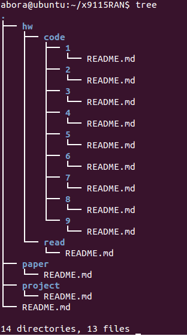
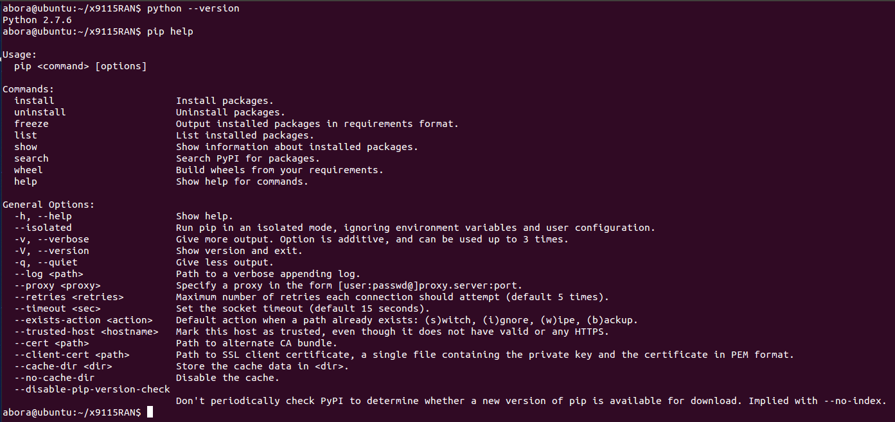
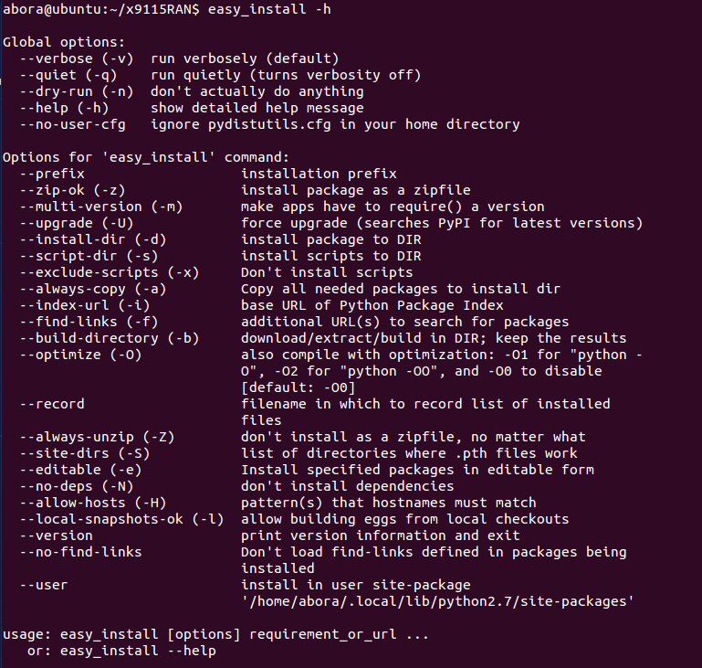
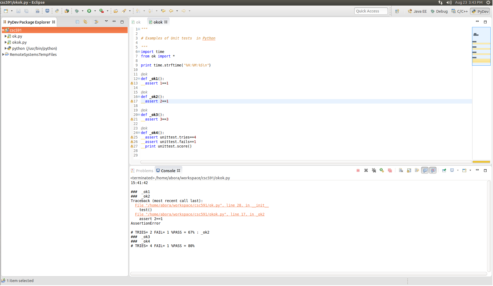

#Homework 1

##Top level of the repo

##Output of the commands python --version, pip help, easy_install -h

A screen shot of what it looks like to write code in your preferred Python IDE
And a screenshot of output of your okok.py test

