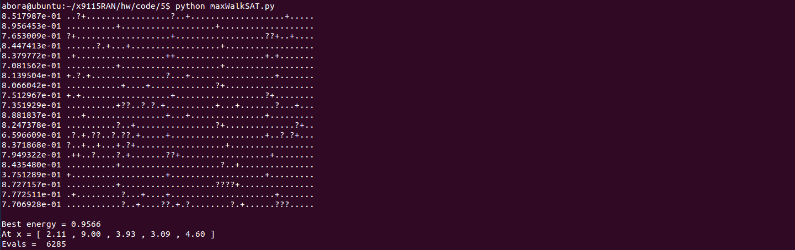

### MaxWalkSat:
 

## Legend
* **?** represents a random jump and the solution changes.
* **+** represents a better solution using a local change along one dimension
* **.** represents a solution that does not change

## Params
* **steps** = 10
* **retries** = 50
* **maxchanges** = 20
