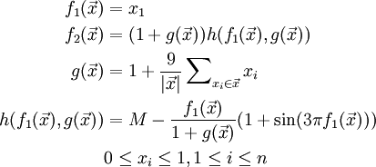

# Code 8: Report

**Contributors:**  
  Anand Bora (abora)  
  Nirmesh Khandelwal (nbkhande)  
  Ravi Singh (rpsingh3)  

##Abstract:
------------------
Today, there are many well known optimization algorithms which are used to solve a wide randge of optimization problems.  
Each algorithm is different in the approach and can be better from each other for different models. Our main goal was to show the process of deciding which algorithm performs better for a given model.  
We implemented three types of comparisons- a) between candidate pairs, b) between sets of candidates from the same optimizer,  c) between sets of candidates from different optimizers.   
Then, we applied three optimization algorithms - Differential Evolution (DE) , MaxWalkSat (MWS) and Simulated Annealing (SA) on model DTLZ7( with 2 objectives and 10 decisions) to decide which one is the best for that model.

Keywords: DE, Simualted Anealing, MWS, Type1, Type2, Type3

##I. Introduction:
-------------------
There are two types of comparisons which are used in optimization algorithms and another type of comparison used to compare and decide which one is better among them for a given model.
For the paper, we have used DTLZ7 model to compare three different optimzation algorithm - DE, SA, MWS.  
**Simulated Annealing** is an optimzation algorithm which uses an probablistic technique to find a good solution(approximate global optimum) for a given model (or a function).  
**Differential evolution** is a stochastic, population-based optimization algorithm which optimzes a problem by iteratively trying to improve candidate solution with regard to given measure of quality.  
**MaxWalkSat** is a non-parametric stochastic method for sampling the landscape of the local region.
All these three uses different apporach to optimize a problem. Now, whicle implementing the above algorithms and comparing them below three types of comparisons are used :  
**Type1**. Between candidate pairs: For deciding if candidate "X" is better than candidate "Y".  
**Type2**. Between sets of candidates from the same optimizer: For deciding early termination; i.e. if sets of candiadtes found in era+1 is no better that era.  
**Type3**. Between sets of candidates from different optimizers: For comparing the final eras generated by different optimizers
The model for which the comparison was done is :
**DTLZ7**. This is one of the DTLZ (Deb, Thiele, Laumanns, Zitzler) multiobjective problems. It has 2 objectives and 10 decisions. [DTLZ7] (http://e-collection.library.ethz.ch/eserv/eth:24696/eth-24696-01.pdf)

##II. Implementation:
--------------------
We implemented DE, SA and MaxwalkSat

DE: Pseudo code
```
FOR i = 1 to max-tries DO
  solution = random assignment
  FOR j =1 to max-changes DO
    IF  score(solution) > threshold
        THEN  RETURN solution
    FI
    c = random part of solution 
    IF    p < random()
    THEN  change a random setting in c
    ELSE  change setting in c that maximizes score(solution) 
    FI
RETURN failure, best solution found
```

SA: Pseudo code
```
s := s0; e := E(s)                  // Initial state, energy.
sb := s; eb := e                    // Initial "best" solution
k := 0                              // Energy evaluation count.
WHILE k < kmax and e > emax         // While time remains & not good enough:
  sn := neighbor(s)                 //   Pick some neighbor.
  en := E(sn)                       //   Compute its energy.
  IF    en < eb                     //   Is this a new best?
  THEN  sb := sn; eb := en          //     Yes, save it.
        print "!"
  FI
  IF    en < e                      // Should we jump to better?
  THEN  s := sn; e := en            //    Yes!
        print "+"                        
  FI
  ELSE IF P(e, en, k/kmax) < rand() // Should we jump to worse?
  THEN  s := sn; e := en            //    Yes, change state.
        print "?"
  FI
  ...
  print "."
  k := k + 1                        //   One more evaluation done    
  if k % 50 == 0: print "\n",sb
RETURN sb                           // Return the best solution found.
```

DE: Algorithm
```
Major difference in approach is forming the next era candidates.
At each iteration, for a candidate solution 
1. Three different random candidate solutions are picked from the frontier, say, X, Y and Z.
2. Now for each solution other than X,Y,Z , do uniform crossover and generate a new solution 
at some probability (called the crossover factor):
        New = X + f * (Y - Z)
3. If New is better than the old, then replace the old with the new.
```

DTLZ7 model:  



For comparison between optimizers below four checks were followed and each algorithm was assigned a rank.  
1. Visualize the data, somehow.
2. Check if the central tendency of one distribution is better than the other; e.g. compare their median values.
3. Check the different between the central tendencies is not some small effect.
4. Check if the distributions are significantly different;

The experiment was repeated 20 times, ie, each algorithm was run 20 times to optimze model DTLZ7 and then their final eras were compared to determine the rank.

##III. Results
-----------------------------
Below are the results which were seen on running DE,SA, MWS algorithms 20 times on DTLZ7 model:
```
rank ,      name ,    med   ,  iqr  
1 ,          mws ,    4.81  ,  0.64 (  -*-          |              ), 4.70,  4.82,  5.34  
2 ,           sa ,    9.09  ,  1.08 (               |     --*--    ), 8.55,  9.12,  9.63  
2 ,           de ,    9.27  ,  1.20 (               |     ---*--   ), 8.60,  9.31,  9.80  
```
MWS gave the best results in our experiment.
Please see the [8.log](https://github.com/boraanand/x9115RAN/blob/master/hw/code/8/8.log) for detailed output.

##IV Conclusions
------------------------------
MWS is the best optimzer for optimzing DTLZ problems with 2 objectives and 10 decisions.

##V. Threats to validity
---------------------------------
**1. Conclusion validity**  
The experiment was run 20 times to avoid this threat of validity.  
**2. Dependability**
The experiments were giving consistent results on every run. So, we are pretty sure that this threat is avoided as well.

##VI. Future Scope
The comparisions can be done on other variants of DTLZ7 as well as on completely different models like Schaffer etc.

