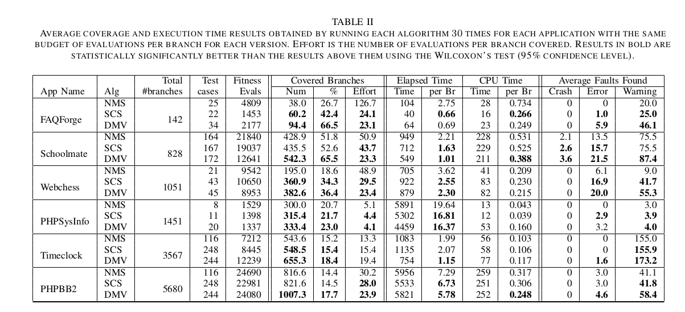
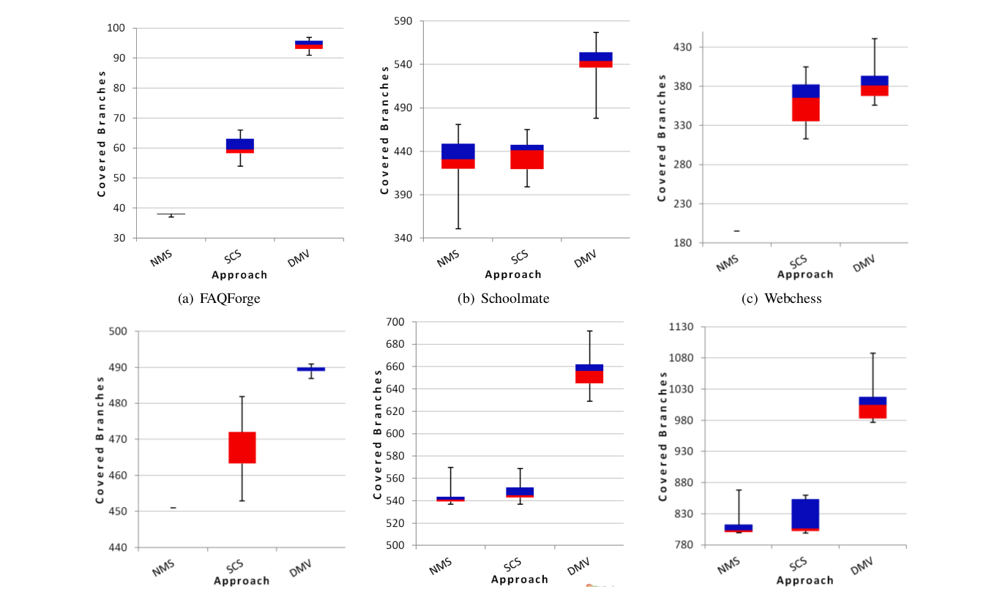

Reference:
-----------
By Nadia Alshahwan and Mark Harman, 2011. Automated Web Application Testing Using Search Based Software Engineering. In ASE '11 Proceedings of the 2011 26th IEEE/ACM International Conference on Automated Software Engineering. [Link](http://www0.cs.ucl.ac.uk/staff/mharman/ase11-na.pdf)

ii: Keywords:
------------------
#### ii1: Search based Software Engineering: 
Is an approach to convert SE problems into optimization problems, which can then be solved by searching optimal solution(s) in the search space. 

#### ii2: Fitness function: 
Fitness function is a formal function used to compare the solutions generated by search algorithm. 

#### ii3: Alternating Variable Method(AVM): 
Is a way of search in which we make changes to one input variable by keeping all the input variables fixed. If mutation to a selected variable  improves fitness value, we try to accelerate change in same direction. The process is repeated for each variable until the optimum solution is achieved or no further improvement is possible.

#### ii4: Static Constant Seeding(SCS) & Dynamically Mined Value(DMV) Seeding: 
* Seeding is used to initialize the input vector in the search process. 
* In Static Constant Seeding(SCS), we initialize the inputs by constants that are derived from the domain knowledge of source code. 
* In DMV, we mine the source code in runtime to generate the values for input vector. Web application contains a lot of information about the input values in the dynamically generated HTML for e.g: valid input might be present as a list of drop down values. We extract these values during runtime to generate the input vector.

iii: Artifacts:
---------------
#### iii1. Motivational statements:
Manual testing of the Web application is tedious but very important task. Search based Software engineering can help to generate test cases automatically. Although search based software engineering is used for test generation of traditional standalone application, web applications presents us with its own challenges. There are 4 main challenges faced for automatic test generation in web applications - 
* **No consistent interface definition in the web page:** There is no specification regarding how many i/p the program accepts or what are their type.
* **Dynamic typing:** No information is present regarding data type of inputs
* **Identification of top level pages of application:** for user simulation of the applicattion, we have to know the start page of the web application
* **Dynamic includes of other pages:** The include name can be decided on runtime.

#### iii2. Sampling procedures: 
The author chose six PHP applications to test the new method of testing. The reason for choosing these projects is that they have already been used other research on Web testing using non search based approaches. The author provides reference [1] for this other research. 

#### iii3: Baseline results:
The author provides significant results of the Branch coverage By 3 different Algorithms, each of which is run 30 times. These results can be directly used in future studies to compare the performance of other enhancements or alterations of the used Algorithms in the study.

#### iii4. Informative visualizations: 
The author provides neat Box plots to show the results of running the automated tests generated by each of the 3 algorithms for 30 runs on each of 6 web applications. From this plot, one can easily understand the variation of results by each algorithm. Since the Search based techniques are stochastic, we need such analyses to understand the results better.

iv: Improvements:
-------------
It was a very well written research paper, so its really difficult to find any improvements.

#### iv1: 
The branch coverage statistics is presented for 3 Search based Algorithms. It would have been nice to compare them with non search based algorithms.

#### iv2: 
The author mentions Wilcoxin's test to check statistical significance of the results. It would have been nice if author explains some more context or information about the test, or why this test was used. 

#### iv3:
The author uses static analysis to figure out certain initial steps such as type of input or start page of application. But author has not explained any algorithms used for same. Author states that they use Input Format Extractor and File Tree Analyzer for the purpose, but no insights have been given on the internal workings of these components. This could have been part of the paper.

##### References:
[1] Shay Artzi, Adam Kiezun, Julian Dolby, Frank Tip, Daniel Dig, Amit
Paradkar, and Michael D. Ernst. Finding bugs in web applications
using dynamic test generation and explicit-state model checking. IEEE
Transactions on Software Engineering, 36:474–494, 2010.