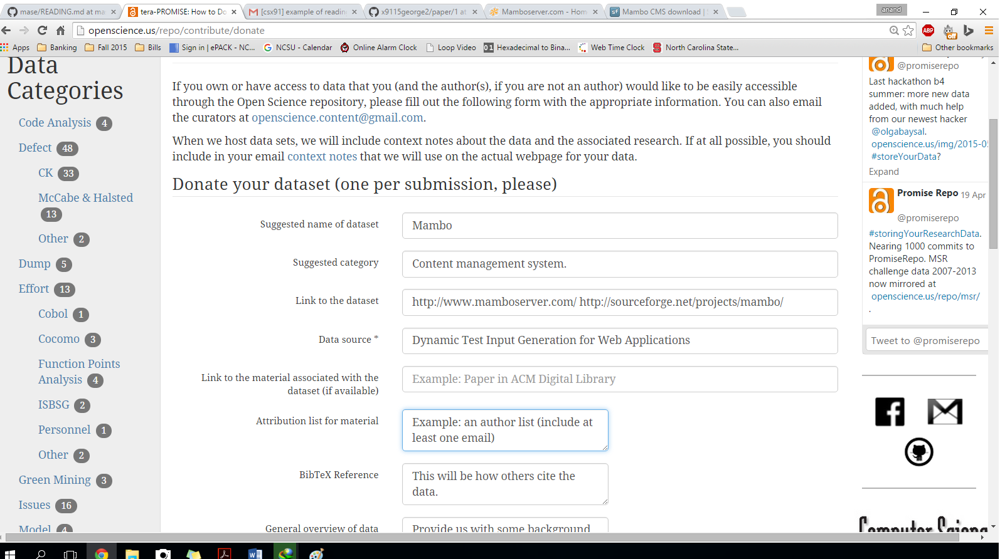
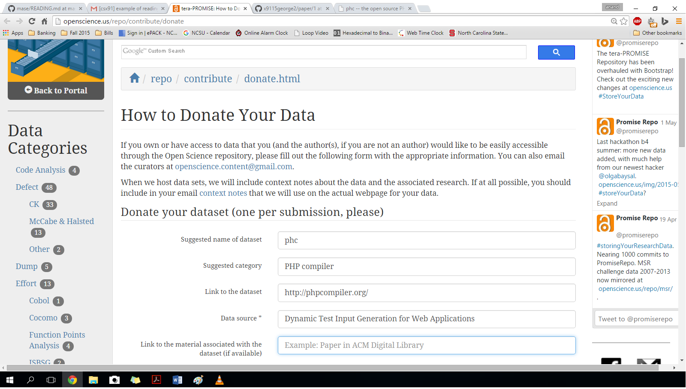
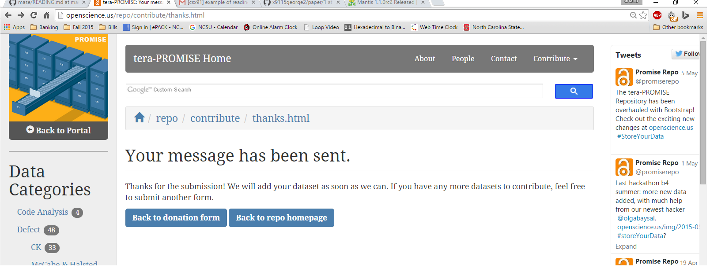

Four resuable open source softwares were identified in the paper and reported [here](https://www.acm.org/sigs/publications/proceedings-templates).

    a.	Mantis 1.0.0rc2, is an open source bug tracking system, similar to Bugzilla

    b.	Mambo 4.5.3, is an open source content management system.

    c.	Utopia News Pro 1.3.0, is a news management system.

    d.	PHC is an open source PHP front-end compiler.

