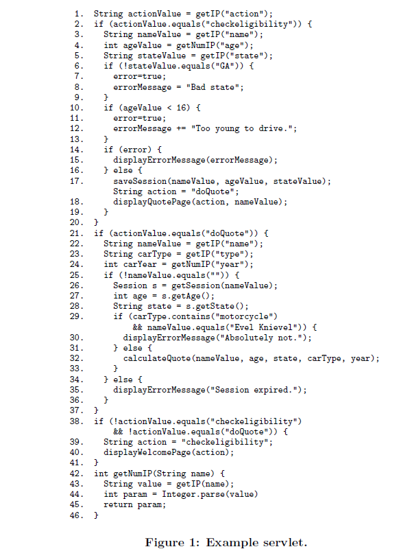
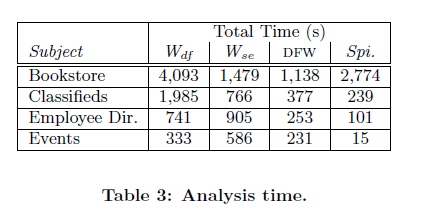
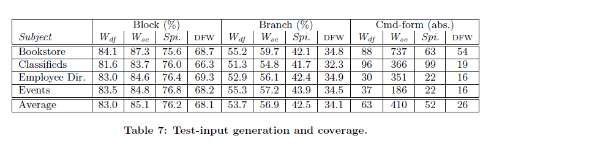

# Summary 
## (i) Reference : 
## Precise Interface Identification to Improve Testing and Analysis of Web Applications
William G.J. Halfond, Saswat Anand, and Alessandro Orso

Georgia Institute of Technology

{whalfond|saswat|orso} @ cc . gatech . edu

[Paper](http://dl.acm.org/citation.cfm?id=1572305)
[Download](http://www-bcf.usc.edu/~halfond/papers/halfond09issta.pdf)

## (ii) Keywords
  * (ii1)**Interface identification** : Identifying how components of a (web) application communicate extensively. To generate content for the end user, the components of a web application communicate by sending a certain type of HTTP request,
called an interface invocation, to the interfaces of other components. An interface invocation provides arguments in the form of name-value pairs (e.g., login=username).
  * (ii2)**Symbolic Execution** : Is a means of analyzing a program to determine what inputs cause each part of a program to execute
  * (ii3)**Domain-constraining operations** : Certain types of operations that we call domain-constraining operations, implicitly constrain the domain of an IP. Examples of these operations are functions that convert an IP value into a numeric value or comparisons of the IP value against a specific value.
  * (ii4)**Interface domain constraint (IDC)** : the set of constraints place on an accepted interface along a specific execution path an interface domain constraint (IDC). An accepted interface may have more than one IDC associated with it, if different domain-constraining operations are performed on its IPs along different paths.

## (iii) Artifacts
* (iii1) **Motivation** : As web applications become more widespread, sophisticated, and complex, automated quality assurance techniques for such applications have grown in importance. Accurate interface identification is fundamental for many of these techniques, as the components of a web application communicate extensively. Current techniques for identifying web application interfaces can be incomplete or imprecise. To address these limitations, paper present a new approach for identifying web application interfaces that is based on a specialized form of symbolic execution.
* (iii2) **2.	Tutorial materials** : Paper gives an example web application to illustrate the technique. approach works in three main steps. In the first step, technique performs a transformation of the web application so that IPs are represented as symbolic values and domain-constraining operations are modeled by symbolic operations. In the second step, technique symbolically executes the web application and generates a set of PCs for each component. In the third step, technique identifies the accepted interfaces and interface domain constraints of the web application by analyzing the PCs generated during symbolic execution.

Sample code in paper, on which testing was done:

* (iii3) **3.	Data** : Two reusable projects are discussed, which we have submitted  at http://openscience.us/repo/contribute/donate.

    a.	**Java PathFinder (JPF)** an explicit-state model checker for Java programs

    b.	**YICES** is an Satisfiability modulo theories (SMT) solver that decides the satisfiability of formulas containing uninterpreted function symbols with equality, linear real and integer arithmetic, bitvectors, scalar types, and tuples.

* (iii4) **Related Work** : 

    i.	developer-provided interface specifications:
    
        1.	F. Ricca and P. Tonella. Analysis and Testing of Web Applications. In International Conference on Software Engineering, pages 25{34, May 2001.
      
        2.	X. Jia and H. Liu. Rigorous and Automatic Testing of Web Applications. In 6th IASTED International Conference on Software Engineering and Applications, pages 280{285, November 2002.
        3. A. A. Andrews, J. Outt, and R. T. Alexander. Testing Web Applications by Modeling with FSMs. In Software Systems and Modeling.

    ii.	Sophisticated heuristics approach:
    
        1.	Y. Huang, S. Huang, T. Lin, and C. Tsai. Web Application Security Assessment by Fault Injection and Behavior Monitoring. In Proc. of the 12th International World Wide Web Conference (WWW 03), pages 148{159, May 2003.
      
        2.	X. Yuan and A. M. Memon. Using GUI run-time state as feedback to generate test cases. In ICSE ’07: Proceedings of the 29th International Conference on Software Engineering, pages 396–405, Washington, DC, USA, May 23–25, 2007. IEEE Computer Society.

## (iv) Statistical tests	:
  * Paper examines time needed to analyse various web applications. 

  * Paper also shows examines for each application.

